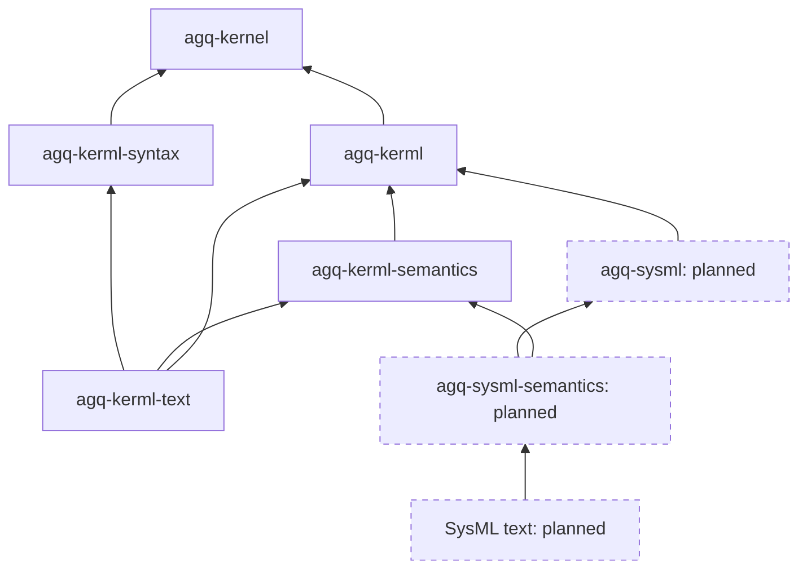
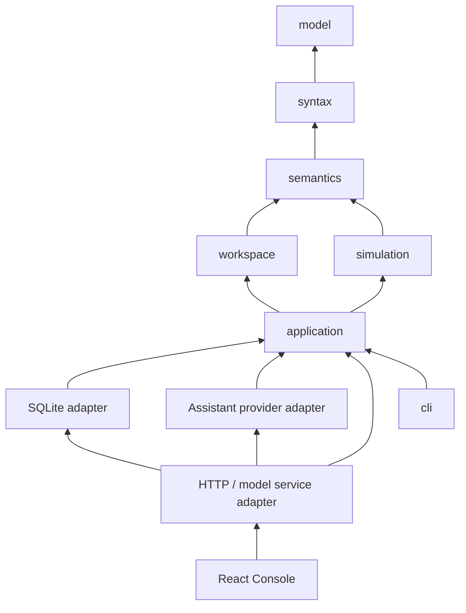

# Agentique architecture: two generations

Generation 1 is the functioning integrated application described below. Generation 2
is the standards-driven engine for all new language implementation; it does not yet
power the application. Compatibility/migration work must name its generation.
Keep the [v0.1 release coverage](../standards/coverage.json) and requirements intact;
use [generation-2 status](../standards/v2-coverage.json) for new engine capabilities.

The shared metamodel importer now handles SysML 2.0, but runtime descriptor
registration is [blocked by published property metadata](sysml-v2-runtime-blocker.md).
Planned SysML runtime nodes below remain unimplemented.

The modeling-platform milestone's prerequisite check reproduced this blocker on
fetched `main`; its stages 0-6 have not begun. See the
[platform prerequisite record](../verification/modeling-platform-v2/README.md)
for the exact base, commands and resumption conditions. Repository, API, view and
transformation boundaries must be designed against the completed generation-2
language stack before they are shown as implemented components here.

## Generation 2: language engine under development

Arrows point from a consumer to its dependency. Dashed nodes are planned; they do
not imply existing SysML support. The generator is maintenance tooling and emits
checked-in descriptors; it is never a runtime or build-script dependency.

Canonical data lives in generic immutable kernel records. Borrowed typed views
project those records without copied fields or a second graph. Language semantics
reuse evidence-bearing queries; inherited elements retain their original identity.
Parsers preserve text and supply declarations/references, never canonical truth or
name denotation. Source identity and semantic identity remain distinct. Unsupported
syntax, unresolved references and unimplemented semantic rules remain explicit.

Normative targets are KerML 1.0 and SysML 2.0. Metamodel import, runtime descriptor
closure, semantic queries, textual grammar and library ingestion have distinct
coverage. Generation 2 has no application migration, persistence repository,
Systems Modeling API or execution. See the foundation details below and
[semantic kernel guide](semantic-kernel.md), including ADRs 0001–0006.

## Generation 1: integrated v0.1 application

The Engine is implemented here. It does not wrap a modelling application. Language
meaning comes from the three supplied OMG publications; product and experiment
scope comes from the supplied HTML. The original files and embedded engineering
artifacts remain unchanged. See [standards discrepancies](standards-discrepancies.md).

`model`, `syntax`, `semantics`, `workspace`, and `simulation` have no database,
HTTP, browser, or provider dependency. Their public APIs accept values and return
values or diagnostics. `agentique simulate` uses those APIs without opening a
workspace database. `Application` centralizes typed proposals, authority,
revisions, scenarios, experiment controls, and durable acknowledgement. CLI,
HTTP, and Assistant do not implement independent model semantics.

## Language implementation decision

A handwritten lexer, recursive descent declaration parser, and Pratt expression
parser were selected for the bounded textual subset. The evaluation criteria were
UTF-8 byte spans, recovery without changing source, partial declarations, explicit
unsupported syntax, expressions, and control over stable identity reconciliation.
Parser generators such as Pest would automate recognition but would still require
the same lossless source store, recovery policy, abstract-syntax construction and
semantic resolver. Tree-sitter would provide incremental syntax but would require
a maintained SysML/KerML grammar and the same separate semantic implementation.
No complete, verified third-party Rust SysML semantic implementation was assumed.
The repository's executable evaluation is `agq-syntax`'s grammar/recovery,
malformed-source and exact-expression tests, followed by independently validated
SysML fixtures. This was a scoped engineering comparison, not a comparative
performance benchmark of three parser implementations.

The parser constructs declarations, scoped references, expressions, comments and
source ranges; it is not regular-expression extraction. Original source is the
lossless concrete representation. Unknown syntax remains in source and in
diagnostics. It is not rewritten from a reduced abstract syntax tree. Semantic
expansion attaches explicit rule-labelled relationships and derived elements.
See the five-axis [coverage register](../standards/coverage.json) for the precise
distinction between interpreted constructs, retained source and executable scope.

## Identity, edits and persistence

Authored declarations receive UUIDs. Qualified names and paths locate declarations;
they are not their identity. Reviewed rename and move edits update source references
by resolved token spans and reconcile IDs into the next revision. Derived elements
use a UUID derived from their owning declaration and semantic role. Runtime
occurrences use fresh IDs independent of either category. Explicit external-source
reconciliation accounts for every previous ID; stale or unused mapping entries are
rejected. Source replacement is intentionally stricter than guessing a rename.

An invalid draft has its own durable record and diagnostics. A candidate change set
cannot replace the accepted revision until validation succeeds. Proposals carry
their base revision and exact source diff; commits are atomic and stale bases fail.
Old runs and their manifests never acquire the current model's names or sources.

SQLite is the local deployment alternative to the specification's proposed
PostgreSQL infrastructure: a single local project does not require an external
database service. The application depends on a typed Store contract, not SQLite.
WAL, FULL synchronous commits, record checksums, an exclusive process lock and
atomic transactions implement acknowledgement. A transaction includes objects,
audit event, and idempotency receipt. In-memory head/run caches change only after
commit. Immutable manifests and appended trace records are stored separately from
compact checkpoints. Run candidates share immutable plans and trace snapshots;
trace appends use copy-on-write so a failed durable commit cannot change a prior
snapshot. A server restart marks unfinished runs interrupted; it does
not resume them. A CLI invocation may attach to a paused run, but cannot share the
same database with another Engine process. Schema versions newer than supported
are rejected rather than overwritten. Private database records are not interchange.

The actor comes from the authenticated adapter: a local operator session or the
single Assistant. JSON cannot supply an actor. This deliberately moves the proposed
contract's `actor_id` from untrusted input to the authenticated command envelope.
Receipts are keyed by actor and command ID, and include the canonical payload hash.
The canonical form is serde serialization of typed values with ordered maps; this
is Agentique's private digest contract, not a claim of RFC 8785 canonicalization.

## Experiment semantics

AGQ-SEQ-01 prepares one resolved flat exclusive state occurrence. It pins model,
scenario, libraries, contract, Engine build, ordered inputs, parameter values,
transitions, source references and limits. Initialisation follows the succession
immediately after empty entry. A step checks the stop condition, next ordered input,
matching receiver and payload type, and all eligible guards; exactly one transition
must be enabled. No match and multiple matches block without consuming input.
Unsupported effects, time, hierarchy, parallelism, explicit executable inheritance,
non-unit executable multiplicity and unsupported expressions block preparation.
Structural connections and other behaviours are expressly excluded from the plan.

Integer comparisons use arbitrary-precision integers (4096-digit limit), never
floating point. Scalar type identity is resolved against the pinned ScalarValues
declarations. Scenario values cannot contradict an authored fixed literal. Guards
are pure; type witnesses used in preparation never become runtime defaults.
There are no effect providers or ambient I/O capabilities in the runtime.

Semantic traces exclude wall-clock timestamps. Normalization excludes generated
run/occurrence IDs while retaining model identity and logical order. A completed
experiment is distinct from a check verdict; documentary requirements remain
`not_run`. Input exhaustion, ambiguity, limits, interruption and evaluation errors
are separate outcomes. A failed step changes diagnostics/status only, not the
committed semantic state or input cursor.

The declared memory budget is deterministic runtime accounting: eight times the
serialized immutable plan plus 16 KiB, and 2048 bytes per trace record. It is a
conservative reservation for the bounded value structures, not an operating-system
RSS limit. Actual process memory is measured separately by `tools/benchmark.ps1`.
The application retains full traces in memory and loads stored revisions on
demand; aggregate workspace memory is not subject to a global quota. Source work
is bounded to 2,000 files, 32 MiB total, 8 MiB per file, 200,000 tokens per file,
100,000 declarations, nesting 128, and 100 edits per change set. These are explicit
allocation/work limits rather than a claim to cap process RSS. `WorkControl`
publishes lexing, parsing, resolution, validation and expansion progress and
cooperatively cancels before commit. A mutex serializes cancellation against the
start of durable commit; cancellation arriving after that boundary is refused.
The server allows at most eight pending command jobs and sixteen background
operations, retaining 64 job results. CLI/in-process callers use the same work
contract without requiring an HTTP executor. Lost job responses are recovered
using the original idempotent command ID and durable receipt.

## Console and Assistant

The React Surface projects real Engine declarations, references, behaviour edges,
source text and run history. The graph is a view of resolved transition endpoints;
the tree, tables and properties provide non-diagram inspection. Layout is local
presentation state. Scenario JSON is experiment configuration and never defines
states or transitions. Source, rename, type, value, move and connection changes use
the same candidate/commit boundary. Source and modelling jobs expose progress and
cancellation; run history pages through all stored records in batches of 1,000.

The Conversation carries project, selection, revision and optional run context.
The deterministic adapter exercises real typed tools. The live adapter uses an
environment-configured chat-completions transport and permits exactly one typed
tool selection per request. Its responses are grounded in actual Engine results;
it does not fabricate a model description or a successful mutation. Both use the
same approval workflow. Approvals bind the actual Assistant actor, reviewed payload,
base revision and expiry, and are consumed once. The provider has no approval tool.

The server binds loopback, requires a local session bearer credential for APIs, and
rejects cross-origin API requests. This is a single-user local application, not a
multi-tenant deployment. `AGENTIQUE_ASSISTANT=test` is visibly labelled. Provider
failure leaves manual Engine operations available.

## Interchange and API

Text export emits the original `.sysml`/`.kerml` source and a clearly private
identity sidecar. `.kpar` is a ZIP project with standard top-level `.project.json`
and `.meta.json`, language URI, project dependencies, index and SHA256 checksums,
plus the private identity extension. It is not a renamed database archive.
Unsupported extra archive entries are refused to avoid lossy export. No full
interchange-conformance claim is made.

The separate `/api/model` adapter maps a read subset of Systems Modeling API 1.0:
projects, main branch, commits, elements and roots, with standard paging parameter
names and Link headers. The element result is a partial metaclass projection, not
a complete OMG abstract-syntax serialization. The API coverage register enumerates
every published operation and its status. All simulation routes are exclusively
under `/api/agentique`.

## Standards-driven foundation

The additive generic `agq-kernel` foundation is described in ADR 0001. The intended
runtime dependency direction is `agq-kernel` <- `agq-kerml` <- future `agq-sysml`.
Language-specific descriptors and rules belong above the kernel.

[`tools/metamodel-gen`](../tools/metamodel-gen/) imports hash-pinned KerML 1.0 MOF
XMI into a neutral IR and cross-checks overlapping facts in the normative JSON
serialization schema. It is engineering tooling, not canonical runtime storage;
no runtime crate reads its neutral JSON IR. Generated Rust descriptors are compiled
into `agq-kerml`. [ADR 0002](adr/0002-normative-metamodel-pipeline.md)
records authority, identity, retained property semantics and the decisions needed
before generating runtime descriptors. Existing language coverage is unchanged.

`agq-kerml` now depends only on `agq-kernel` and registers a generated, structurally
closed Root/Core descriptor slice. [ADR 0003](adr/0003-normative-root-core-descriptors.md)
records normative property evidence, inheritance resolution and canonical association
boundaries. Runtime crates do not depend on the importer. Existing application
language support and execution coverage remain unchanged; descriptor registration
does not implement KerML rules.

`agq-kerml` also supplies generated constants and borrowed typed views for this
same slice. [ADR 0004](adr/0004-kerml-typed-views.md) describes the API and its
minimal generic association-slot prerequisite. A typed view stores an element ID
and a reference to the existing immutable kernel model; it is not another
canonical object. The kernel remains language-neutral.

`agq-kerml-semantics` evaluates pure ownership, membership, specialization, direct
typing/subsetting/redefinition and bounded effective-feature queries above these
views. [ADR 0005](adr/0005-kerml-semantic-query-foundation.md) defines full semantic
context identity, positive/search dependencies, completeness and proof graphs.
A minimal generic ordered-many/scalar-inverse association storage shape enables
declared ownership without precomputed language facts. Inherited features retain
their kernel identities. No parser, cache framework or execution behavior is added.
New kernel consumers use the query facade; the older application model remains
separate pending an explicit migration.

The additive second-generation textual frontend is `agq-kerml-syntax` (immutable
source revisions, lossless tokens/range CST, borrowed syntax views) and
`agq-kerml-text` (source history, conservative edit reconciliation and lowering).
[ADR 0006](adr/0006-lossless-kerml-text-frontend.md) records the parser comparison,
normative slice, recovery and identity contract. Text lowers directly through
`agq-kerml` descriptors to `agq-kernel` snapshots; neither crate uses `agq-model`.
Name denotation remains in `agq-kerml-semantics`, whose context includes pending
specialization scope obligations during working-model resolution. SourceOrigin
pins document, source revision, UTF-8 byte range and optional syntax identity;
canonical records hold no parser objects. The kernel can transactionally update
element provenance while preserving historical snapshots and semantic identities.

The slice accepts named namespaces, types with required specialization, features,
feature typing, subsetting and redefinition. Relationships and owning memberships
are first-class records. Unsupported or malformed headers do not assert semantics;
valid incomplete bodies can still form a working model. Unresolved/ambiguous
references remain explicit assertions outside the structurally valid snapshot.
`validate_slice` distinguishes this working state from successful bounded syntax,
resolution and semantic-query checks. It is not full KerML validation or executable
verification. Full imports/inheritance name resolution, library implication and
additional descriptors are required before broadening into SysML. Application,
HTTP and simulation continue to use their existing implementation.
